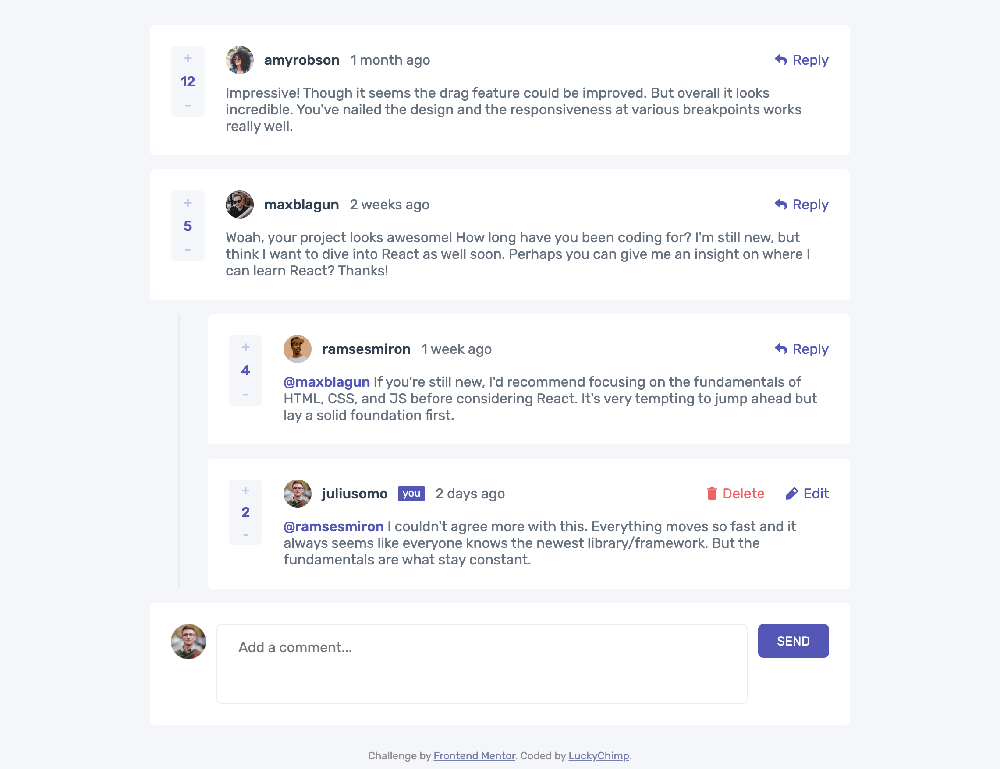

# Frontend Mentor - Interactive comments section solution

This is a solution to the [Interactive comments section challenge on Frontend Mentor](https://www.frontendmentor.io/challenges/interactive-comments-section-iG1RugEG9). Frontend Mentor challenges help you improve your coding skills by building realistic projects.

## Table of contents

- [Overview](#overview)
  - [The challenge](#the-challenge)
  - [Screenshot](#screenshot)
  - [Link](#link)
- [My process](#my-process)
  - [Built with](#built-with)
  - [Useful resource](#useful-resource)
- [Author](#author)

## Overview

### The challenge

Users are able to:

- View the optimal layout for the app depending on their device's screen size
- See hover states for all interactive elements on the page
- Create, Read, Update, and Delete comments and replies
- Upvote and downvote comments
- **Bonus**: Access the website with the same state as when it was closed, as everything is stored on the server side via a REST API
- **Bonus**: See the past time up to the time the comment or reply was created. For this purpose unix timestamps are created, stored and retrieved.

### Screenshot

### Link

- Solution URL: [https://interactive-comments-section-xi.vercel.app/](https://interactive-comments-section-xi.vercel.app/) (hosted on [Vercel](https://vercel.com/))

## My process

### Built with

- Semantic HTML5 markup
- SCSS for clean, easy and less CSS
- Flexbox
- Mobile-first workflow
- [React](https://reactjs.org/) - JS library

### Useful resource

- [React Docs](https://beta.reactjs.org/) - Docs of React

## Author

- Frontend Mentor - [@LuckyChimp](https://www.frontendmentor.io/profile/LuckyChimp)
